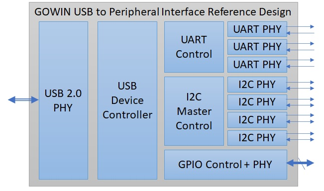
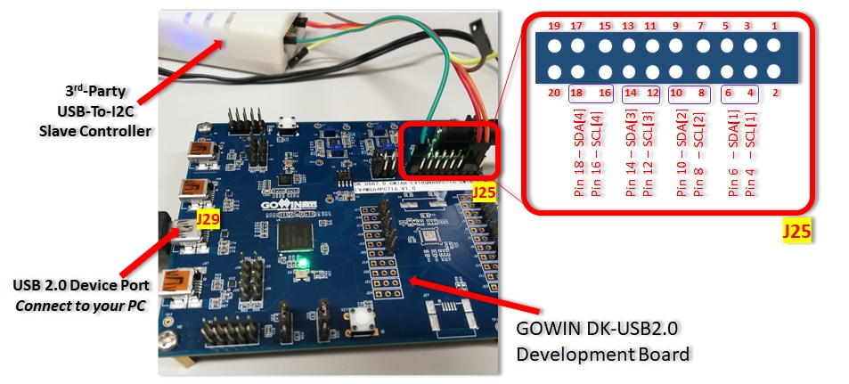
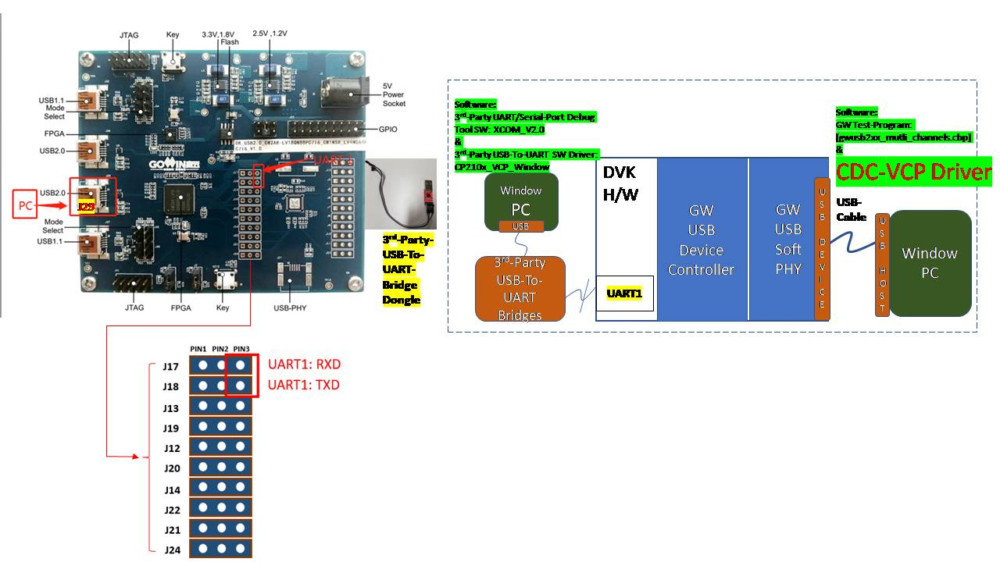

# USB2Peripheral
###  ⚠*We are in the process of updating this design to support multiple peripheral types on each port based on a top level parameter as well as documentation, demonstration platform and test setup.  The current design has parameterization for up to 3 UART ports, up to 4 I2C ports and up to 10 GPIO pins.  Future updates to design will support more flexibility in number of ports and addition of I2C, UART, SPI, JTAG, GPIO, and potentially I3C.

## Introduction
The USB2Peripheral reference design enables GOWIN FPGAs to bridge between USB 2.0 and a variety of peripheal interfaces types and ports.  The design can used to communicate, control, configure and program various semiconductor ICs such as microcontrollers, FPGAs, sensors, and more.

## Key Features
1. USB 2.0 PHY and Device Controller
2. Configurable Number of Interfaces and GPIOs
3. Up to 4 I2C  Interfaces
4. Up to 3 UART Interfaces
5. Up to 10 General Purpose IOs
6. Windows, Linux and MacOS VCP (Virtual COM Port) Drivers Compatibility
7. WinUSB and LibUSB Drivers for control of I2C and GPIO
  

  
## Top Level Port List

| Port            | Direction | Pin Number | Description |
| --------------- | --------- | ----------- | ----------- |
| ***Parameters***                      |           |             |        |
| num_i2c_ports                            | - | - | 1 to 4 I2C ports |
| num_uart_ports                           | - | - | 1 to 3 UART ports |
| num_gpio                                 | - | - | 1 to 10 GPIOs     |
| ***Input Clocks*** |           |             |             |
| CLK_IN   | Input | 10 | 50Mhz (USB) |
| ***I2C Interfaces 1 through 4*** |           |             |             |
| I2C_SCL[1:4]   | inout  | 81,83,85,15 | I2C Clocks 1-4        |
| I2C_SDA[1:4]   | inout  | 82,84,86,16 | I2C Data   1-4        |
| ***UART Interfaces 1 through 3*** |           |             |            |
| UART_TXD[1:3]  | Output | 31,29,27  | UART Transmit 1-3 |
| UART_RXD[1:3]  | Input  | 30,28,26  | UART Receive 1-3 |
| ***General Purpose IO*** |           |             |            |
| PARALLEL_GPIO[9:0]  | Output |32,33,34,35,36,37,38,39,40,41,42| GPIOs 0-9|
| ***USB 2.0 Interface*** |           |             |             |
| usb_vbus     | Input | 31 | USB VBUS Monitor |
| usb_dxp_io   | Input/Output | 73 | USB IO Data |
| usb_dxn_io   | Input/Output | 72 | USB IO Data |
| usb_rxdp_i   | Input | 77 | USB IO Monitor |
| usb_rxdn_i   | Input | 71 | USB IO Monitor |
| usb_pullup_en_o | Output | 80 | USB 1.5k Pull Up Control |
| usb_term_dp_io | Input/Output | 75 | USB Termination Control |
| usb_term_dn_io | Input/Output | 74 | USB Termination Control |

## FPGA Project

The GOWIN FPGA project targets the GOWIN GW2AR-18 FPGA device and the GOWIN DK_USB2.0.  This provides a vast amount of resources for design expansion and debug.  Please note that the GOWIN USB 2.0 PHY IP requires a C8/I7 speed grade.  The DK-USB2.0 board may contain a slower speed grade device such as C7/I6.  For functional development purposes this will not cause issues with running the demo or using it to prototype your solution.  However, to ensure timing closure over all process, voltage and temperature ranges please choose C8/I7 for products and board designs going into production.

###### How to Open FPGA Project

1. Ensure latest version of GOWIN EDA is installed and an active license is setup
2. Open GOWIN EDA
3. File --> Open --> Navigate to 'gwusb_bridges.gprj'

The reference design is written in Verilog HDL.  Pin constraints for the GOWIN DK_USB2.0 Development Board are setup in the gwusb_bridges.cst and timing constraints for the various clock domains is provided in gwusb_bridges.sdc.  The below table describes each Verilog file in the design and its function in the design.

| Verilog Design File Name | Module Name               | Description                             |
| ------------------------ | ------------------------- | --------------------------------------- |
| TOP.v            | Top           | Top Level Design                               |
| gowin_rPLL.v     | Gowin_rPLL    | USB Clock Domain PLL (480Mhz and 60mhz)        |
| uart.vp          | UART          | UART PHY                                       |
| usb_uart_ctrl.vp | usb_uart_ctrl | Control of UART PHYs via USB device controller |
| iic.v            | atciic100     | I2C PHY |
| usb_i2c_ctrl.vp          | usb_i2c_ctrl              | Control of I2C PHYs via USB device controller|
| usb_gpio_ctrl.vp         | usb_gpio_ctrl             | Control of GPIOs via USB device controller   |
| USB_Device_Controller_Top.v  | USB_Device_Controller_Top | USB 1.1/2.0 Device Controller                |
| usb2_0_softphy_top.v           | USB2_0_SoftPHY_Top                          | USB 2.0 PHY|
| usb_descriptor_iic_spi_upar.vp | usb_desc                  | USB Device Descriptor Initialization         |

| Constraint file | Description                      |
| --------------- | -------------------------------- |
| gwusb_bridges.cst   | Pin Constraint File              |
| gwusb_bridges.sdc   | Clock and Timing Constraint File |

## Resource Utilization

The GOWIN USB 2.0 to Peripheal Reference Design is optimized for low density FPGAs and can fit in both LittleBee and Aurora FPGA product families.  The design resources are dependent on the types and number of interfaces used.  A design with four I2C ports, three UART ports and 10 GPIOs is under 7.5K LUTs making it the ideal choice for developing a variety of different products.

| Resource Type | Resource Count (4xI2C, 3xUART, 10xGPIO) |
| ------------- | -------------- |
| LUT           | 7267           |
| REG           | 2955           |
| PLL           | 1              |
| BSRAM         | 12              |

## Fabric Clocks FMAX
| Clock      | Operating Frequency (Mhz) | Maximum Frequency (Mhz) | Description      |
| ---------- | ------------------------- | ----------------------- | ---------------- |
| CLK_IN     | 50                        | NA                      | Reference Clock to PLL|
| USB_FCLK   | 480                       | NA                      | USB Serializer   |
| USB_PCLK   | 60                        | 60.498                  | USB UTMI System  |
| USB_CLKDIV | 120                       | 160.611                 | USB PHY Internal |

## Demo Setup
The GOWIN USB 2.0 to Peripheal Reference Design targets the DK-USB2.0 Development board.  Each interface can be tested individual or together in various ways.  The next sections will describe one method for testing and getting started with communication over each interface.

### I2C Demonstration Setup:  GOWIN DK-USB2.0 + 3rd party I2C to USB Adapter
The below image shows a method for testing the I2C interfaces of the USB to Peripheal Reference Design.  I2C ports are connected to IO on the J25 header of the GOWIN DK-USB2.0 Development Board.  A 3rd party USB to I2C Slave box can be used to provide a slave device for testing the interface.  For our setup we used the "BUS ADAPTER" by Toomoss (availible at http://www.toomoss.com/product/8-cn.html), but other adapters can be used for the same type of test.

winusb.sys or libusb.sys drivers must be installed for the GOWIN DK-USB2.0 Development Board and the reference design based on the opperating system being used.

####Steps to install winusb.sys Driver on Windows
1. Download and install Zadig-2.7.exe (as administrator) `*\USB2Peripheral\sw\Windows\GWUSB2XX_Multi_Channels_Win_V1.0\tool\Zadig-2.7.exe`
2. ...

### UART Demonstration Setup:  GOWIN DK-USB2.0 + 3rd party UART to USB Adapter
The below image shows a method for testing the UART interfaces of the USB to Peripheral Reference Design. The PC is connected to J29 on DVK board, the third pins of J17 (RXD) and J18 (TXD) are the data signal of UART1, which are connected to the PC through a third party USB2UART tool. Data Read/Write transmission can be Observed through the GW Multi-Protocol-USB-Bridge test program and a PC Serial Port Debugging Tool (With installed SW Driver).

### UART Demonstration Setup:  GOWIN DK-USB2.0 + 3rd party GPIP to USB Adapter
[To Do]

